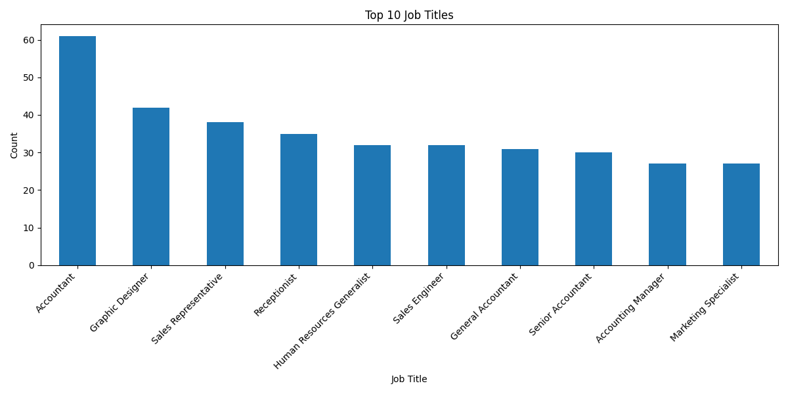
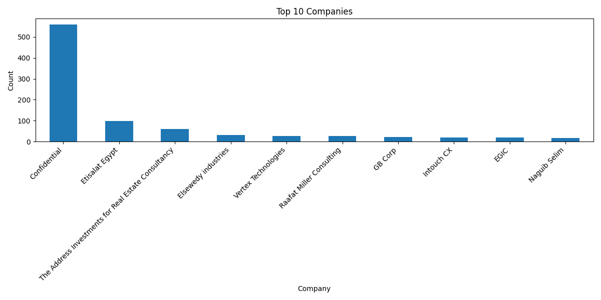

# 📊Egypt Job Market Analysis
Till 03:00 PM 8 April 2026
## 🚀 Overview

This project analyzes the Egyptian job market using real data scraped from WUZZUF.
It transforms raw job listings into meaningful insights through data cleaning, analysis, and visualization.

---

## 🎯 Problem Statement

Understanding job market trends in Egypt is challenging due to scattered and unstructured data.
This project solves that by collecting and analyzing real job postings to uncover patterns in hiring demand.

---

## 🛠️ Tech Stack

* Python
* BeautifulSoup (Web Scraping)
* Pandas (Data Analysis)
* Matplotlib (Visualization)
* Google Looker Studio (Dashboard)

---

## ⚙️ Data Pipeline

### 🔹 1. Data Collection

* Scraped job listings from WUZZUF
* Extracted:

  * Job Title
  * Company
  * Location
  * Experience Level
  * Skills

### 🔹 2. Data Cleaning

* Removed duplicates
* Handled missing values
* Standardized text fields

### 🔹 3. Data Analysis

* Top job titles
* Top companies
* Job distribution by location
* Employment type analysis
* Career level trends
* Skills frequency

### 🔹 4. Visualization

* Static charts using Matplotlib
* Interactive dashboard using Looker Studio

---

## 📊 Key Insights

* Majority of jobs are Full-time and On-site
* Cairo dominates job opportunities
* Experienced roles are more common than entry-level
* Communication and Excel are among the most required skills

---

## 💊 Specialized Analysis

### Pharma Jobs

* Identified using keyword filtering
* Analyzed hiring companies and locations

### Data Jobs

* Compared against pharma jobs
* Highlighted demand differences

---

## 📈 Dashboard

🔗 [Add your Looker Studio link here]

---

## 🖼️ Sample Outputs




---

## 💻 Project Structure

```text
wuzzuf_project/
├── data/
├── outputs/
├── src/
├── README.md
└── requirements.txt
```

---

## ▶️ How to Run

```bash
pip install -r requirements.txt
python src/scrape_wuzzuf.py
python src/clean_wuzzuf.py
python src/analyze_wuzzuf.py
```

---

## 📌 Future Improvements

* Real-time job tracking
* NLP analysis on job descriptions
* Salary insights
* Web app deployment (Streamlit)

---

## 👨‍💻 Author

Ahmed Fathi
Pharmacist | Data Analyst
